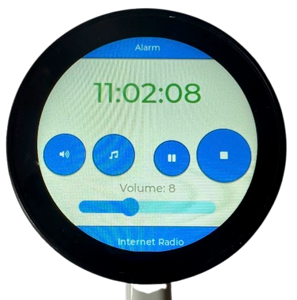
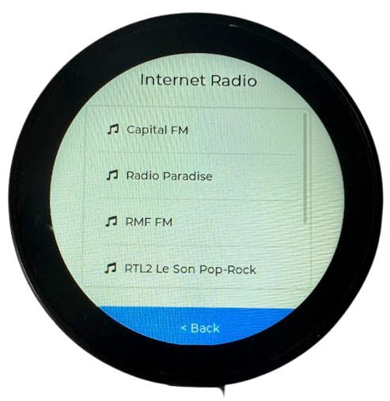

# ESP32-S3 AI Voice Assistant with LCD, Mic, Speaker and LLM Backend

This project implements a multi-modal, real-time voice assistant platform using the **ESP32-S3-Touch-LCD-1.85C-BOX**. 
The project combines **offline and online speech processing**, a **touchscreen GUI**, **I2S audio**, **Internet radio**, **SD card playback**, and **a cloud-assisted LLM agent** with **WebSocket communication**. 

It is designed for prototyping local AI interfaces with low-latency connectivity to a powerful backend.
The project is based on [ESP32-S3-Touch-LCD-1.85C-BOX](https://www.waveshare.com/wiki/ESP32-S3-Touch-LCD-1.85C). 

<table width="100%">
  <tr>
    <td width="33.3%"></td>
    <td width="33.3%"></td>
    <td width="33.3%"></td>
  </tr>
</table>


## Hardware Overview

- **Board**: ESP32-S3-Touch-LCD-1.85C-BOX
- **CPU**: ESP32-S3 (240 MHz dual core)
- **Display**: 1.85" 360×360 LCD (ST77916)
- **Touch**: CST816T (I2C)
- **Audio**:
  - Input: ICS-43434 microphone (I2S)
  - Output: PCM5101 DAC (I2S)
- **Storage**:
  - 16 MB QSPI flash
  - 8 MB OPI PSRAM
  - microSD via SD_MMC (4-bit)
- **Power**: 3.7V lithium battery support

## Features

### AI Assistant

**Microphone → WAV → WebSocket to Flask Server → Whisper → GPT-4 → ESP32 → Google Translate TTS → PCM5101**

- Speak a phrase (e.g., "What is 2 plus 2?")
- ESP32 records WAV (or streams via WebSocket)
- Python backend transcribes it (OpenAI Whisper)
- Prompt sent to GPT-4 (LLM agent)
- Result converted to speech (Google Translate TTS)
- Played back through the DAC

You can choose between two implementations:
- **Streaming via WebSocket** (no local storage)
- **Recording to WAV** (stored on SD card, then uploaded via HTTP POST)

There is **no noticeable latency difference** between both methods due to network and server processing overhead.

### Internet Radio

- Loads list from `/internet_stations.txt`
- Plays MP3 or AAC streams
- GUI-based selection
- Volume and pause/resume support

### MP3 Player (SD card)

- Reads from `/music/*.mp3` or `.wav`
- GUI scrollable list
- File-based audio playback via I2S


## AI Assistant Flow Diagram

```plaintext
┌────────┐
│  MIC   │ (ICS-43434, I2S)
└──┬─────┘
   │  (Record or Stream)
   ▼
┌────────────┐  .WAV via HTTP or RAW PCM via WebSocket
│   ESP32    │ ──────────────────────────────────────▶
│  Uploads   │     │ 
└────────────┘     │  
                   ▼
              ┌────────────┐
              │  Python    │
              │  Backend   │
              └────┬───────┘
                   │ 
                   │  (agent loop)
                   ▼
        ┌────────────────────────┐
        │ 1. Whisper (Transcribe)│
        │ 2. ChatGPT (Reasoning) │
        │ 3. JSON Reply          │
        └────────┬───────────────┘
                 │
                 ▼
         ESP32 receives response via WebSocket
                 ▼
        ┌────────────────────┐
        │ Google Translate   │
        │ Text-to-Speech API │
        └────────┬───────────┘
                 │
                 ▼
        ┌──────────────────┐
        │  ESP32 Audio Out │──▶ PCM5101 DAC
        └──────────────────┘

```

## GUI Features

- Home screen with clock and scrolling message bar
- Volume slider with live adjustment
- Playback controls: Pause / Stop
- Navigation buttons to:
  - MP3 Player (SD card)
  - Internet Radio (from SD list)
  - Voice Assistant (stream or upload)
  - Alarm Screen
  - Fullscreen Clock View
- Swipe navigation supported across screens (optional)
- Stylized UI using [LVGL](https://docs.lvgl.io/)

---

## Compilation and Upload (PlatformIO)

### Build
```bash
export WIFI_SSID=""
export WIFI_PASSWORD=""
export WEBSOCKET_URL="ws://<server-ws-url>:8765/"
export UPLOAD_URL="http://<server-upload-url>:8766/upload"
source ~/.platformio/penv/bin/activate
pio run
```

### Upload Firmware
```bash
pio run -t upload
pio run -t upload --upload-port /dev/tty.usbmodem2101
```

### Upload Filesystem (models from ./data)
```bash
pio run -t uploadfs
```

### List attached devices
```bash
pio device list
```

### Monitor Serial (with decoding)
```bash
pio device monitor
```


## Web API Endpoints

### General Control

| Endpoint       | Method | Parameters                 | Description                                      |
|----------------|--------|----------------------------|--------------------------------------------------|
| `/status`      | GET    | —                          | Returns system status: WiFi, memory, uptime, etc. |
| `/backlight`   | POST   | `on=1` or `on=0`           | Turns LCD backlight on or off                   |
| `/volume`      | GET    | —                          | Returns current volume level                    |
| `/volume`      | POST   | `value=0..21`              | Sets volume level                               |
| `/stop`        | POST   | —                          | Stops any active audio playback                 |
| `/speech`      | POST   | `text=...`, `lang=en|pl`   | Speaks given text using TTS                     |
| `/play`        | POST   | `url=http://...`           | Starts playback of a stream URL                 |
| `/playfile`    | POST   | `path=/music/file.mp3`     | Plays audio file from SD card                   |

---

### File Management

| Endpoint       | Method | Parameters                             | Description                                     |
|----------------|--------|----------------------------------------|-------------------------------------------------|
| `/upload`      | POST   | `file=<binary>` + `path=/folder/`      | Uploads file to SD card                         |
| `/download`    | GET    | `path=/music/file.mp3`                 | Downloads specified file                        |
| `/preview`     | GET    | `path=...`                             | Previews file (infers MIME type)                |
| `/listfiles`   | GET    | `path=/` or `ext=mp3` or `type=json`   | Lists files in directory                        |
| `/mkdir`       | POST   | `path=/foldername`                     | Creates directory on SD card                    |
| `/rmdir`       | POST   | `path=/foldername`                     | Removes folder recursively                      |
| `/delete`      | POST   | `path=/file.txt`                       | Deletes file or folder                          |
| `/move`        | POST   | `from=/old`, `to=/new`                 | Moves or renames file                           |

---

### Streaming / Internet Radio

| Endpoint       | Method | Parameters                 | Description                                      |
|----------------|--------|----------------------------|--------------------------------------------------|
| `/stream`      | GET    | —                          | Streams raw microphone audio (PCM, 16-bit)       |
| `/stations`    | GET    | —                          | Loads list from `/internet_stations.txt` |


### SERVER: http://5.9.104.22:8766/


### Upload files to SDCARD

```
export ESP32_IP=http://192.168.0.32

curl -X POST "$ESP32_IP/upload?path=/" -F "file=@./sdcard/style.css"
curl -X POST "$ESP32_IP/upload?path=/html/" -F "file=@./sdcard/index.html" 
curl -X POST "$ESP32_IP/upload?path=/html/" -F "file=@./sdcard/internet_radio.html"
curl -X POST "$ESP32_IP/upload?path=/html/" -F "file=@./sdcard/file_explorer.html" 
curl -X POST "$ESP32_IP/upload?path=/html/" -F "file=@./sdcard/alarms.html" 
curl -X POST "$ESP32_IP/upload?path=/" -F "file=@./sdcard/internet_stations.txt"
curl -X POST "$ESP32_IP/upload?path=/" -F "file=@./data/srmodels.bin"
```

### Display file content from SDCARD
```
curl "http://<esp32-ip>/download?path=/file_explorer.html"
```

### Download file from SDCARD
```
wget "http://<esp32-ip>/download?path=/readme.txt" -O readme.txt
```

### LCD Backlight
```
curl -X POST "http://<esp32-ip>/backlight" -d "on=1"
```

### Play Internet Radio
```
curl -X POST "http://<esp32-ip>/play" -d "url=http://31.192.216.8:80/rmf_fm"
```

### Play file from SDCARD
```
curl -X POST -d "path=/file_example_MP3_700KB.mp3" http://<esp32-ip>/playfile
```

### Text to speach
```
curl -X POST "http://<esp32-ip>/speech" -d "text=Hi ESP&lang=en"
```

### List SDCARD files
```
curl http://<esp32-ip>/listfiles\?path\=/
```

### Update SR Model from SDCARD to model partition
```
curl http://<esp32-ip>/update_srmodels?force=true
```

### ESP-SR Model

https://github.com/espressif/esp-sr/tree/master/model/wakenet_model/wn9_jarvis_tts

wn9_data
wn9_index

SR_MN_EN_MULTINET5_SINGLE_RECOGNITION_QUANT8
mn5q8_en

SR_WN_WN9_HIESP
wn9_hiesp

### ESP-SR Log

```
✅ ESP-SR models initialized with 2 models
Model 0: mn5q8_en, Info: MN5Q8_v2_english_8_0.9_0.90
Model 1: wn9_hiesp, Info: wakeNet9_v1h24_Hi,ESP_3_0.63_0.635
Initializing WN interface...
MIC SR Start
[  5330][D][esp32-hal-sr.c:338] sr_start(): init model
[  5330][D][esp32-hal-sr.c:346] sr_start(): load wakenet 'wn9_hiesp'
MC Quantized wakenet9: wakeNet9_v1h24_Hi,ESP_3_0.63_0.635, tigger:v3, mode:2, p:0, (Nov  5 2024 16:02:49)
[  5463][D][esp32-hal-sr.c:351] sr_start(): load multinet 'mn5q8_en'
[  5463][D][esp32-hal-sr.c:353] sr_start(): load model_data 'mn5q8_en'
Quantized8 Multinet5: MN5Q8_v2_english_8_0.9_0.90, beam search:v2, (Nov  5 2024 16:02:48)
[  5712][I][esp32-hal-sr.c:358] sr_start(): add 5 commands
[  5714][I][esp32-hal-sr.c:361] sr_start():   cmd[0] phrase[0]:'Turn on the backlight'
[  5721][I][esp32-hal-sr.c:361] sr_start():   cmd[1] phrase[1]:'Turn off the backlight'
[  5729][I][esp32-hal-sr.c:361] sr_start():   cmd[2] phrase[2]:'backlight is brightest'
[  5737][I][esp32-hal-sr.c:361] sr_start():   cmd[3] phrase[3]:'backlight is darkest'
[  5744][I][esp32-hal-sr.c:361] sr_start():   cmd[4] phrase[4]:'play music'
[  5752][D][esp32-hal-sr.c:373] sr_start(): start tasks
[  5756][I][esp32-hal-sr.c:142] audio_feed_task(): audio_chunksize=1024, feed_channel=3
```

## Other links

ESP32-S3-Touch-LCD-1.85C-BOX Schematic:
https://files.waveshare.com/wiki/ESP32-S3-Touch-LCD-1.85C/ESP32-S3-Touch-LCD-1.85C-Schematic.pdf

Arduino_GFX:
https://github.com/moononournation/Arduino_GFX/tree/master

LVGL
https://docs.lvgl.io/master/examples.html

ESP32-audioI2S PCM5101
https://github.com/schreibfaul1/ESP32-audioI2S

SD_MMC library:
https://github.com/espressif/arduino-esp32/blob/master/libraries/SD_MMC/README.md

A Guide to Fusing ChatGPT with Espressif SOCs:
https://developer.espressif.com/blog/unleashing-the-power-of-openai-and-esp-box-a-guide-to-fusing-chatgpt-with-espressif-socs/

Building a Real-Time AI Voice Assistant on an ESP32 with OpenAI and Langchain:
https://github.com/FabrikappAgency/esp32-realtime-voice-assistant/tree/main

ElatoAI: Realtime Speech AI Agents for ESP32
https://github.com/akdeb/ElatoAI/blob/main/README.md

That Project
https://github.com/0015/ThatProject

ESP-SR Speech Recognition Framework:
https://github.com/espressif/esp-sr/
